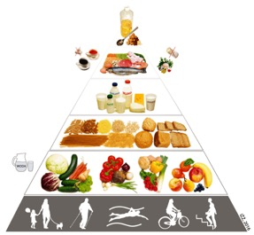

= [big blue]#**Żyj zdrowo**#

*Czy wiesz, że twój sposób odżywiania wpływa nie tylko na to, jak wyglądasz - czy jesteś szczupła czy masz nadwagę - ale również na twój stan zdrowia?*

Żywienie człowieka to dostarczanie ludzkiemu organizmowi odpowiednich pokarmów zapewniających utrzymanie jego podstawowych procesów życiowych.  
Pokarmy te mogą być pobierane w stanie naturalnym lub w postaci różnorodnych potraw czy napojów. Racjonalne żywienie człowieka jest dostosowane do 
jego wieku, płci, zapotrzebowania energetycznego, rodzaju wykonywanej pracy, stanu zdrowotnego, klimatu w którym żyje oraz innych czynników.

*Ze względu na rolę w organizmie wyróżnia się 3 podstawowe grupy składników odżywczych pokarmu:*

* *składniki budulcowe*: głównie białka i sole mineralne,
* *składniki energetyczne*: głównie węglowodany i tłuszcze,
* *składniki regulujące*: witaminy, niektóre sole mineralne, błonnik.

Źródło: <https://pl.wikipedia.org/wiki/Żywienie_człowieka>

== Piramida żywienia

 
[#img-docs/piramida]
Rys.1. Piramida żywienia.

Pośród wszystkich spożywanych posiłków największy udział procentowy w komponowaniu potraw powinny posiadać warzywa i owoce, gdyż są niskokaloryczne, dostarczają dużą ilość witamin i składników mineralnych, oferują sporą dawkę błonnika i sycą. Wraz z nimi znajduje się woda. Piramida zdrowego żywienia na kolejnym poziomie umieściła produkty zbożowe, ziemniaki i rośliny strączkowe – stanowić powinny one główne źródło węglowodanów. Warto jednakże zdecydować się na pieczywo i makarony pełnoziarniste oraz ryż brązowy i dużą ilość kasz, maksymalnie nieprzetworzonych. Kolejny poziom to mleko i jego przetwory. Podczas wkomponowywania je w menu, należy zwracać uwagę na wysoką kaloryczność większości serów.

Przedostatnia pozycja dedykowana została rybom, jajkom i mięsie, które są ważne dla naszego zdrowia, ale powinny być spożywane z umiarem. Instytut Zdrowego Żywienia umieścił na tej wysokości także kawę i herbatę z uwagą, iż powinny być one przyrządzane w niesłodzonej postaci. Ponadto podkreśla znaczenie, jakie ma ograniczenie soli w codziennej diecie, zalecając zwiększenie używania ziół i innych przypraw w ramach zachowania właściwego smaku. Na samym szczycie piramida zdrowego żywienia umieściła tłuszcze, orzechy oraz węglowodany proste, z zaznaczeniem, iż cukier warto zastąpić miodem, a tłuszcze zwierzęce – oliwą, olejem rzepakowym czy olejem kokosowym. Tak skomponowana piramida prawidłowego żywienia daje ogólny zarys zasad, jakimi powinniśmy się kierować na co dzień.

 
[#img-docs/bieg]
Rys.2. Sport to zdrowie.

W świetle najnowszych badań naukowych oraz diagnostycznych, powstała piramida żywieniowa, która u swoich podstaw ma aktywność fizyczną. Jest to przełom w rozpatrywaniu naszego sposobu życia. Kierunek ten pokazuje, iż sposób komponowania posiłków jest niezwykle ważny, natomiast podstawą dla zachowania zdrowia jest codzienny ruch. Aby go zapewnić, warto zmienić nawyki i postawić na min. 30 minut spaceru dziennie i chodzenie po schodach (doskonały trening cardio) zamiast jeżdżenia windą. Jak najbardziej zalecane jest uprawianie sportów – najlepiej dostosowanych do swoich możliwości fizycznych i upodobań (wtedy mamy większą szansę na zmobilizowanie się do regularnego ruchu).

Źródło: <http://www.kobiety.pl/zdrowie/piramida-zdrowego-zywienia>

== Żywienie a zdrowie

Zastosowanie odpowiedniej diety może stanowić element leczniczy w przypadku niektórych jednostek chorobowych lub też znacznie łagodzić ich objawy.

[cols=2*]
|===
|Dieta nisko węglowodanowa
|*łagodzenie objawów cukrzycy oraz opóźnienie występowania jej powikłań*

|Dieta bogata w antyoksydanty oraz wielonienasycone kwasy tłuszczowe
|*złagodzenie objawów, częściowa lub całkowita regresja zmian miażdżycowych w naczyniach krwionośnych*

|Dieta pozbawiona glutenu
|*możliwość całkowitego wyeliminowania objawów celiakii*

|Dieta wysoko błonnikowa
|*leczenie zaparć*
|===

Tabela 1. Wpływ diety na leczenie niektórych chorób lub łagodzenie ich objawów.

Źródło: < http://www.ukladaniediety.pl/kacik-wiedzy/zywienie/wplyw-zywienia-na-stan-zdrowia>
